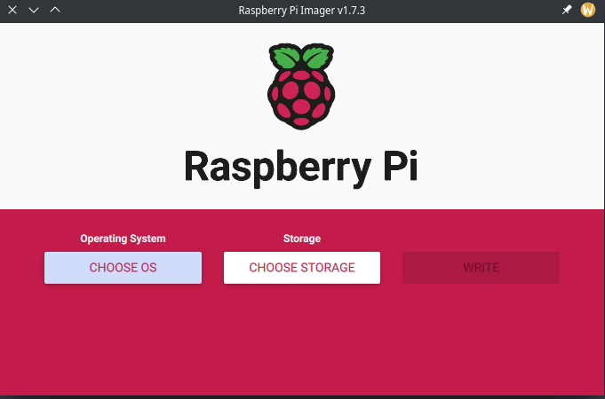
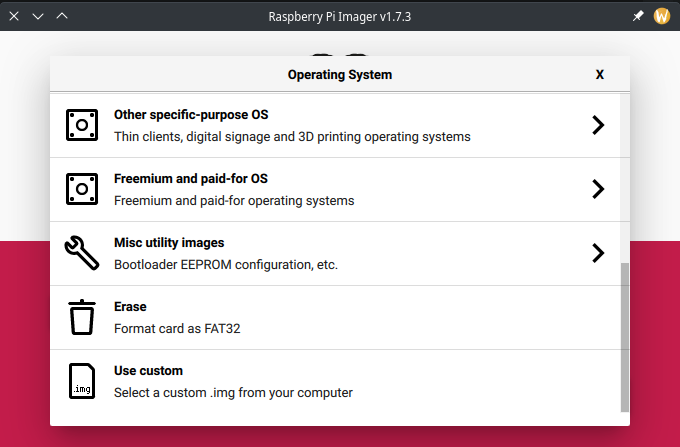

<p align="center">
  
</p>

# pyArmClock

- [pyArmClock](#AlarmClock)
  - [Features](#Features)
  - [Hosting](#Hosting)
  - [Installing](#Installing)
  - [ToDo](#ToDo)
  - [Platform Availability](#Platform-Availability)
  - [Saving and Config](#Saving-and-Config)
  - [Adding New Music](#adding-new-music)
  - [Manual Time Entry](#manual-time-entry)
  - [Pulseaudio Issue](#Pulseaudio-Issue)
      
A quick and dirty python based alarm clock with a GUI and alarm saving functionality. Allows for choosing of song/audio that you wake up to and can speak the time before playing the audio. Works great on a raspberry pi as well as other linux based OS's with automated setup using ansible.

## Features
- Alarm Functionality
- Song Choice
- Setup Automation
- Custom Snooze Duration (10 mins by Default)
- GUI with custom themes implemented
- Large List of Custom Clock Fonts
- Saves previous theme, font, and song choice in config file after reboots
- Saves up to 3 Alarms with custom names - More will be implemented in the furture

## Installing

#### There's two options for instalation on a Raspberry Pi - Automated with Ansible and install an image directly to an sd card. For an easy and painless install go the image direct option.

The ansible install is a little more hands on and can be seen as a bit of a learning experience. They both work great though and instructions are provided for both below. 

#### **Raspberry Pi Image Install**

This method is now available!

From now on as I update the alarm clock I'll release a new edition of the raspberry pi image along side it.

1. To install using the reaspberry pi image download the pyArmClock.img.tz file from the latest release. 

2. Next, I recommend using the raspberry pi imager tool to install the os on an sd card. You can download it [here](https://www.raspberrypi.com/software/) or install it using package management if on linux. 

3. Once opened you should see a window like this

Select the "Choose OS" option. On the botton you should see a "Use Custom" option. Select that, and then select the pyArmClock.img.tz file from where it got downloaded to on your computer. 


4. Now choose your storage, simply an SD card you'd like to install pyArmClock to. Note: Your SD card must be at least 11GB for it to work. 

5. Now write!

6. Once completed, plug the SD card into your raspberry pi and boot it up. pyArmClock will immediately boot upon the desktop starting up. Select 'yes' on the first prompt to go full screen from here on out.

Additional Information:
Default Username: pi
Default Password: pyArmClock
Some final information on this option. By default, the time will set itself using the internet. You may need to adjust the time zone depending on where you are. To do this you can ssh into your pi while it's online. If you scan your network it will show up as 'pyarmclock.local'. Login and then run 
```
sudo raspi-config
```
From here you can make typical system changes. Time Zone settings are under 'localisation options'.

If you'd rather run without internet you can manually adjust the time from within pyArmClock.

#### **Raspberry Pi Automated Ansible Install:**
NOTE: No ansible knowledge is really needed. Just run these commands exactly.

Simply get a raspberry pi going with the base 32-bit raspberry pi os on it. Leave the user as the default 'pi'. Connect it to the internet and ssh into it. Run these commands next.


Update!
```
sudo apt update
```
Next, ensure git is installed 
```
sudo apt install git
```
Install Ansible
```
sudo apt install ansible
```
Now, pull the Git repo
```
git clone https://github.com/madeofpendletonwool/pyArmClock.git
```
cd into the pulled folder
```
cd pyArmClock/
```
Lastly, run the playbook to set everything up
```
ansible-playbook setup.yaml
```
Reboot!
```
sudo reboot 0
```
#### **x86 Computer Install:**
The intention here is that you can install the alarm clock on anything, regardless of platform or architechture. I may add more options down the road as well for CPU architecture. The instructions are almost the same as with raspberry pi. Just a different playbook. 

Also note that while I tried to make this agnostic of distro, package names vary, and you may need to install some packages manaully/change the playbook. Some basic ansible knowledge might be helpful. 

First, Install ansible - I assume you can handle this based on your distro package management.

Now, pull the Git repo
```
git clone https://github.com/madeofpendletonwool/pyArmClock.git
```
cd into the pulled folder
```
cd pyArmClock/
```
Use your editor of choice to open vars.yml and edit the user to reflect yourself.
```
user_name: your_user_name
```
Lastly, run the playbook to set everything up
```
ansible-playbook x86setup.yaml
```
Reboot!
```
sudo reboot 0
```


## ToDo

 - [x] Create Code that can set off Alarms using a time module
 - [x] Snooze functionality
 - [x] Custom Snooze Duration
 - [x] Deploy via ansible and fully setup using raspberry pi
 - [x] Allow for saving of alarms after reboot
 - [x] Display a big clock on the screen at all times
 - [x] Create alarm clock gui
 - [x] Custom GUI Themes
 - [x] arm it. Need it to run on a raspberry pi
 - [x] Sound function
 - [x] Allow you to choose music/sound to play
 - [x] import of music from a location of choice 
 - [x] Option to select 12 or 24 hour clock
 - [x] Voice function to tell actual time
 - [x] Make theme, previous song choice, and font all write to a yaml file so they continue for each reboot
 - [x] Add a 'Alarm set for:' display after alarm is set
 - [x] Implement 'Full Screen Mode' to play in better with Raspberry Pi. This will ask on first boot if full screen mode is desired. 
 - [x] Support for music files other than mp3's (Can now also select flac files)
 - [x] Show next alarm time while snoozed (shows amount of time snooze duration is set for)
 - [x] Custom Pi image that can be deployed using an img file
 - [ ] Easy setup with package management
 - [x] Implement current date on the main clock screen
 - [ ] Implement custom alarm messages 
 - [ ] Add a check to ensure a song is set. Currently, it's possibly to start an alarm without a song location set. Causing a crash
 - [ ] Additional Customization options. Layout of date for example. 
 - [x] Check is values are populated (This will prevent crashing)
 - [x] Scale Clock interface depending on how big the screen it's created on is. 

## Platform Availability

Raspberry Pi and x86 Systems 

## Saving and Config

The saving functionality of the app is built using a config file. On first boot the program will ask if you'd like to open in full screen mode or not. Depending on what is chosen the intial config file will be slightly different. To revert back to factory setting and get the prompt for full screen mode again simply delete the config file from /home/{username}/pyArmClock. The config file is also used to save everything that the program needs after full reboot (theme, font, saved alarms, snooze duration, 12 or 24 hour time, and location of previous song choice) so removing that file will also revert all those other settings back to factory. If you'd like to save the config file and move previous settings to a different computer you can by just copying that file and placing it in your /home/{username}/pyArmClock folder of the new computer. 

## Adding New Music
You can add new music to the 'Music' folder that gets created on boot. You can choose music anywhere on your computer but the music folder just makes it easy. You can scp music to that location easy enough by simply scping to the pi assuming it's connected to the internet

```
scp /location/of/music/you/want/to/copy {username}@{PiIPAddress}:/home/{username}/pyArmClock/Music
```
From there when you select your song in the clock settings just choose a song from the music folder

## Manual Time Entry

pyArmClock gets it's time automatically from the system. However, you may not have the system connected to the internet considering it's an alarm clock. In such a case, I've implemented the ability to set the time manually. You can do this in the alarm options. 

One thing to note is that this is essentially only temporarily changing the time. The next time the system is connected to the internet it will fix itself. It will also do nothing if the system is connected to the internet already. 

## Pulseaudio Issue

I recently became aware of an issue occationally happening with pulse audio and the alarm clock stopping system sounds entirely. Unfortunatly, this is an issue with Pulse itself and not something that I can fix in the code. On the bright side however it is an easy fix when it does come up and it also can be fixed on a per-user basis. Also meaning, no sudo needed to fix. 

If you have this issue happen look through your system logs for anything involving pulse audio.
```
journalctl | grep pulseaudio
```
If you have the issue you'll see logs that throw this error. 
```
Oct 17 13:53:48 computername pulseaudio[2093]: Failed to create sink input: sink is suspended.
Oct 17 13:53:48 computername pulseaudio[2093]: Failed to create sink input: sink is suspended.
Oct 17 13:53:48 computername pulseaudio[2093]: Failed to create sink input: sink is suspended.
Oct 17 13:53:48 computername pulseaudio[2093]: Failed to create sink input: sink is suspended.
```
To fix it, you can run this command
```
systemctl --user mask wireplumber --now
```
Sudo not needed as we pass the user flag. Yes, this is masking wireplumber. Which isn't explicitly needed for audio. So keep that in mind. Oh linux audio, the unfixable beast. Another potential fix for some computers comes in the way of editing your default.pa file in /etc/pulse
If you comment out this line 
```
load-module module-suspend-on-idle
```
That will fix it for most computers as well. (Might need to reboot for it to take affect.)
Lastly, the other option could be to just not use pulseaudio. Using pipewire-pulse instead will do it. Which is the main reason why it only happens on some computers. It also only happens with certain versions of pulseaudio. 